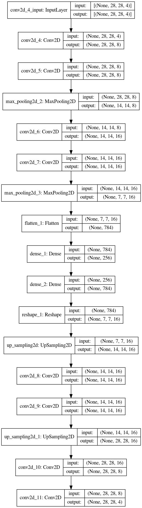

## Satellite Image Encoding using Deep Autoencoders

 
 in
This repository contains training script for image autoencoders for satellite image.
 
[Dataset Link](https://www.kaggle.com/crawford/deepsat-sat4)
 

### Downloading Training Data
`$pip install -r requirements.txt`
 
`$kaggle datasets download -d crawford/deepsat-sat4`

### Training
`$python main.py`

### Model

